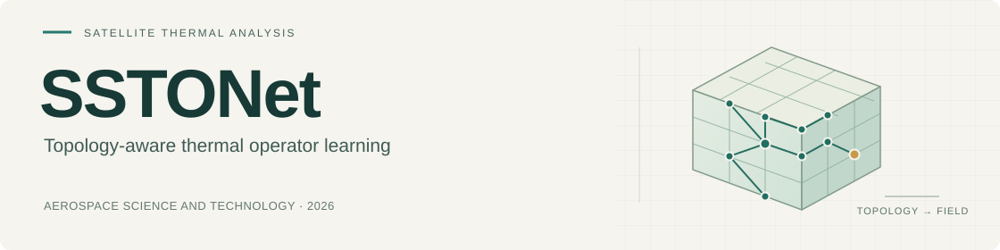
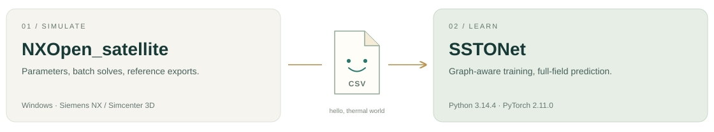
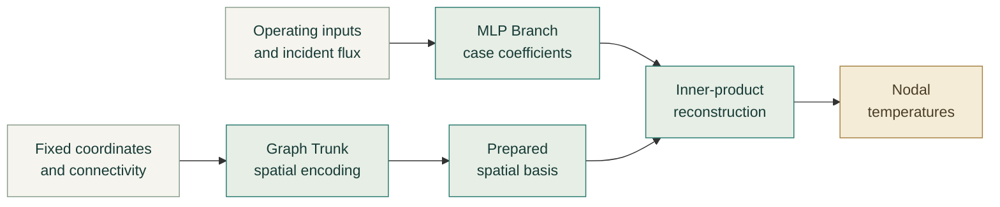

<div align="center">



[](https://doi.org/10.1016/j.ast.2026.114015)
[](https://github.com/Ne1ther/SSTONet/releases/tag/v0.1.1)
[](#installation)
[](LICENSE)

**Research code for satellite steady-state temperature-field prediction.**<br>
<sub>Small satellite. Many temperatures. Two toolboxes.</sub>

[Paper](https://www.sciencedirect.com/science/article/pii/S1270963826023916) · [Quick start](#quick-start-without-data-or-weights) · [Training](#train-on-your-own-data) · [NXOpen companion](#nxopen-companion) · [Citation](#citation-and-license)

</div>

---

## Two repositories, one thermal workflow



| 🛰️ Simulate | 🌡️ Learn and predict |
| :--- | :--- |
| [**NXOpen_satellite**](https://github.com/Ne1ther/NXOpen_satellite) | **SSTONet · this repository** |
| Update thermal parameters, run NX / Simcenter 3D solves, and export reference cases. | Load case exports, train graph-aware operators, and reconstruct nodal temperature fields. |
| Requires Windows and Siemens NX / Simcenter 3D. | Uses Python and PyTorch. The synthetic examples and tests run without NX. |

**The handoff is the exported case data:** engineering-input logs, incident-flux samples, nodal temperatures, and consistent coordinates/node ordering. The [NX export format](#train-on-your-own-data) explains the loader conventions. NXOpen is the simulation companion, not a Python runtime dependency of SSTONet.

## The paper

**Satellite Temperature Field Prediction under Varying Thermal Contact Conditions Using Topology-Aware Operator Learning**

Chang Xu · Haibo Yang · Qianliang Wu · Zhanxiao Liu · Changsheng Zhou<br>
*Aerospace Science and Technology*, 2026, article 114015<br>
[Publisher page](https://www.sciencedirect.com/science/article/pii/S1270963826023916) · [DOI: 10.1016/j.ast.2026.114015](https://doi.org/10.1016/j.ast.2026.114015)

Repeated thermal assessment is expensive when satellite loads, surface properties, and thermal contacts change. SSTONet learns the mapping from these conditions to a complete steady-state temperature field, with particular attention to component and interface errors.

A multilayer perceptron (MLP) **Branch** encodes each operating case. A graph neural network (GNN) **Trunk** learns a spatial basis from fixed coordinates and connectivity. Their inner product reconstructs nodal temperatures. After training, the graph basis can be prepared once and reused across operating cases.

| Reference problem | Published benchmark |
| :--- | :--- |
| Satellite | Fixed 1U CubeSat, 14 components |
| Temperature field | 5,928 output nodes |
| Reference data | 5,000 Siemens NX SST cases |
| Train / validation / test | 4,000 / 500 / 500 cases |
| Network input | 94 engineering entries + 1,328 incident-flux samples |

### Published accuracy

| Model | Mean relative L2 error | RMSE |
| :--- | ---: | ---: |
| **SSTONet-FEM** | **0.6224%** | **2.2293 K** |
| SSTONet-KNN | 0.6675% | 2.3467 K |

These values describe the selected seed-42 models on 500 held-out cases with the benchmark flux inputs. The paper evaluates interpolation within the sampled parameter domain of the fixed assembly. The synthetic example below checks software operation; it does not reproduce these benchmark results.

## Model architecture



**SSTONet-FEM** uses supplied finite-element adjacency. **SSTONet-KNN** uses neighbors within components and radius-based links between components. Geometric edge weights guide spatial encoding; contact and coupling values are supplied through the operating input.

The `sstonet.inference` module provides the reusable Trunk cache. Its validity checks bind the spatial basis to the model, graph, device, and precision. See the [quick-start example](examples/quickstart.py) for normalization and cached prediction.

## Release scope

> [!NOTE]
> **v0.1.1 is a source-code release.** It includes model implementations, eleven principal configurations, training and inference utilities, synthetic examples, and self-contained tests. Pretrained weights, simulation datasets, generated outputs, and manuscript working materials are not distributed.

Training creates your own local checkpoints and fitted normalizers under the output directory. Data and generated artifacts are excluded from Git. Reference-data generation uses the separate [NXOpen_satellite](https://github.com/Ne1ther/NXOpen_satellite) toolkit; the neural models here run in a Python environment.

## Installation

### Recommended: the verified environment

The source-release checks use **Python 3.14.4 and PyTorch 2.11.0**. [environment.yml](environment.yml) records the tested Python and direct library versions, with conda managing Python and the scientific packages.

```bash
git clone https://github.com/Ne1ther/SSTONet.git
cd SSTONet
conda env create --file environment.yml
conda activate sstonet
```

The environment definition installs the local package in editable mode. To use an existing Python 3.14.4 environment instead:

```bash
python -m pip install -r requirements-tested.txt
python -m pip install -e .
```

<details>
<summary><strong>Tested versions and compatibility notes</strong></summary>

| Dependency | Verified version |
| :--- | :--- |
| Python | 3.14.4 |
| PyTorch | 2.11.0 |
| NumPy | 2.4.4 |
| pandas | 3.0.2 |
| SciPy | 1.17.1 |
| scikit-learn | 1.8.0 |
| matplotlib | 3.10.9 |
| PyYAML | 6.0.3 |
| tqdm | 4.67.3 |
| pytest | 9.0.3 |

[requirements-tested.txt](requirements-tested.txt) is a direct-dependency snapshot, not a complete platform-independent lockfile. The package metadata allows Python 3.10 or newer as a language lower bound; older Python/dependency combinations have not been validated for this release.

The checks use CPU on macOS. CUDA and Apple MPS require a suitable [PyTorch installation](https://pytorch.org/get-started/locally/); the training CLI can select those backends. This repository does not require NX, PyTorch Geometric, or `torch_scatter`.

</details>

TensorBoard logging is optional:

```bash
python -m pip install -e ".[tensorboard]"
```

## Quick start without data or weights

🛰️ **Take a tiny test flight.** The example creates a small synthetic problem in memory, trains a compact graph model, and checks that cached prediction agrees with ordinary prediction:

```bash
python examples/quickstart.py --variant fem
python examples/quickstart.py --variant knn
```

It saves no files. The generated temperatures exercise the software interface and are not NX solutions or paper benchmark results.

## Repository layout

```text
.
├── sstonet/
│   ├── models/             # SSTONet and baseline model implementations
│   ├── training/           # Trainers, normalization, checkpoint save/load
│   ├── inference/          # Reusable graph-Trunk basis
│   ├── data/               # NX CSV loader and dataset splitting
│   ├── utils/              # Temperature-field error metrics
│   ├── config.py           # YAML configuration support
│   └── callbacks.py        # Training callbacks
├── configs/                # Eleven principal model configurations
├── assets/                 # README illustrations
├── scripts/
│   └── train.py            # Shared training entry point
├── examples/
│   └── quickstart.py       # Synthetic training and cached prediction
├── tests/                  # Self-contained model and trainer tests
├── environment.yml         # Verified conda environment
├── requirements-tested.txt # Verified direct Python dependencies
├── CITATION.cff
├── LICENSE
├── pyproject.toml
└── README.md
```

## Train on your own data

The training entry point accepts the NX CSV format described below. Supply the export folder and, for FEM-based models, the matching graph folder:

```bash
python scripts/train.py \
  --model gnn_deeponet \
  --config configs/gnn_deeponet.yaml \
  --data-dir /path/to/nx_exports \
  --graph-dir /path/to/graph \
  --output-dir results/my_run \
  --device auto
```

For component-aware neighborhoods:

```bash
python scripts/train.py \
  --model component_gnn_deeponet \
  --config configs/component_gnn_deeponet.yaml \
  --data-dir /path/to/nx_exports \
  --device auto
```

`--device auto` selects an available backend. Use `--device cpu`, `--device cuda`, or `--device mps` to choose explicitly. `--epochs` and `--n-samples` override the YAML settings.

Each run records its effective configuration, exact train/validation/test indices, split hash, training history, error metrics, and locally generated checkpoints. The graph trainers save fitted normalizers with their checkpoints so later predictions can be returned in physical temperature units. Load only checkpoints you generated or trust, because the trainer checkpoint format includes serialized preprocessing objects.

<details>
<summary><strong>All eleven model configurations</strong></summary>


| Model | Training identifier and configuration stem |
| --- | --- |
| SSTONet-FEM | `gnn_deeponet` |
| SSTONet-KNN | `component_gnn_deeponet` |
| Full-field GNN | `pure_gnn` |
| DeepONet | `deeponet` |
| POD-DeepONet | `pod_deeponet` |
| MIONet | `mionet` |
| MLP | `mlp` |
| POD-MLP | `pod_mlp` |
| Geometry-aware operator adaptation | `adapted_geom_deeponet` |
| Physics-attention adaptation | `adapted_transolver` |
| Fourier operator adaptation | `adapted_fourier_deeponet` |

For each identifier, the corresponding file is `configs/<identifier>.yaml`. The configurations retain the reference experiments' model and optimizer settings, with portable data paths and automatic device selection. Their standard split is 80% training, 10% validation, and 10% testing. The three adapted baselines are task-specific implementations of the respective model families.

</details>

<details>
<summary><strong>NX export format and node ordering</strong></summary>


The loader expects case numbers starting at 1. For each case `N`, the export folder contains:

```text
nx_exports/
├── Mixed_Coefficient_DOE_for_nx_automation_N_Solar_vector_log.csv
├── Mixed_Coefficient_DOE_for_nx_automation_N_Load_log.csv
├── Mixed_Coefficient_DOE_for_nx_automation_N_Optical_log.csv
├── Mixed_Coefficient_DOE_for_nx_automation_N_Thermal_coupl_log.csv
└── Mixed_Coefficient_DOE_for_nx_automation_N/
    └── NodeResults/
        ├── NodeResult_<component>_Temperature.csv
        └── Result_<component>_Radiation.csv
```

| Export | Required fields |
| --- | --- |
| Solar vector log | Columns `X`, `Y`, `Z` |
| Load log | Regional powers in the row `Value` |
| Optical log | Rows `Top_inf`, `Bot_inf`, `Top_sunabr`, `Bot_sunabr` |
| Thermal coupling log | Column `value` |
| Temperature CSV | `Temperature`, `X`, `Y`, `Z` |
| Radiation CSV | `Incident_Radiative_Flux_SUN(W/mm2)`, `X`, `Y`, `Z` |

Temperature CSV values are Celsius; the loader converts them to Kelvin. The `TEMPERATURE_COMPONENTS` and `RADIATION_COMPONENTS` lists in [loader.py](sstonet/data/loader.py) define the component concatenation order. Within each component, keep the node order consistent across cases, graph indices, and temperature targets.

The Branch input order is solar direction, incident solar flux, regional powers, emissivities, absorptivities, and contact/coupling values. In the reference problem, these groups have 3, 1,328, 20, 28, 28, and 15 entries, respectively.

A supplied FEM graph folder must contain `edge_index.npy`, an integer array of shape `(2, E)` whose indices match the concatenated temperature nodes. Optional `thermal_coupling_mask.npy` enables interface-region metrics. KNN topology is built from raw node coordinates and component labels. Its radius uses the coordinate units of the input geometry.

</details>

## Use the model API with array data

For datasets in another format, pass arrays directly to a trainer:

```python
from sstonet.models import GNNDeepONet
from sstonet.training import GNNDeepONetTrainer

model = GNNDeepONet(branch_input_dim=X_train.shape[1])
trainer = GNNDeepONetTrainer(model, device="cpu", use_edge_attr=True)
trainer.fit(
    X_train, coords, edge_index, T_train,
    X_val=X_val, T_val=T_val,
    epochs=300, batch_size=32,
)
T_pred = trainer.predict(X_test, coords, edge_index)
```

Here `X_train` has shape `(cases, inputs)`, `coords` has shape `(nodes, 3)`, `edge_index` has shape `(2, edges)`, and `T_train` has shape `(cases, nodes)`. Raw model outputs use the trainer's normalized temperature scale; `trainer.predict` reverses that normalization.

For cached inference, `precompute_trunk(model, coords_t, edge_index_t, edge_weight_t)` returns an object with a `predict` method. Use the same normalized coordinates, input normalizer, and geometric edge weights as training. Call `model.eval()` before preparing the cache. The [quick-start example](examples/quickstart.py) shows the complete normalization and reconstruction steps.

## Tests

```bash
python -m pytest -q
```

The suite uses synthetic data to check model outputs, graph operations, training, checkpoint round trips, best-validation-state restoration, and cache correctness/invalidation. It requires no NX installation, private dataset, or pretrained model.

## NXOpen companion

For new reference simulations, use [**NXOpen_satellite**](https://github.com/Ne1ther/NXOpen_satellite). Its automation handles parameter updates, design-of-experiments batches, solve orchestration, and result export inside NX / Simcenter 3D. Return here to train the neural operators and evaluate their temperature fields. The two repositories keep their own installation requirements and work together through the exported case data.

## Citation and license

If this code supports your research, please cite the paper:

```bibtex
@article{xu2026sstonet,
  title   = {Satellite Temperature Field Prediction under Varying Thermal
             Contact Conditions Using Topology-Aware Operator Learning},
  author  = {Xu, Chang and Yang, Haibo and Wu, Qianliang and Liu, Zhanxiao
             and Zhou, Changsheng},
  journal = {Aerospace Science and Technology},
  year    = {2026},
  pages   = {114015},
  doi     = {10.1016/j.ast.2026.114015}
}
```

Machine-readable metadata is available in [CITATION.cff](CITATION.cff). The source code is provided under the [MIT License](LICENSE).
