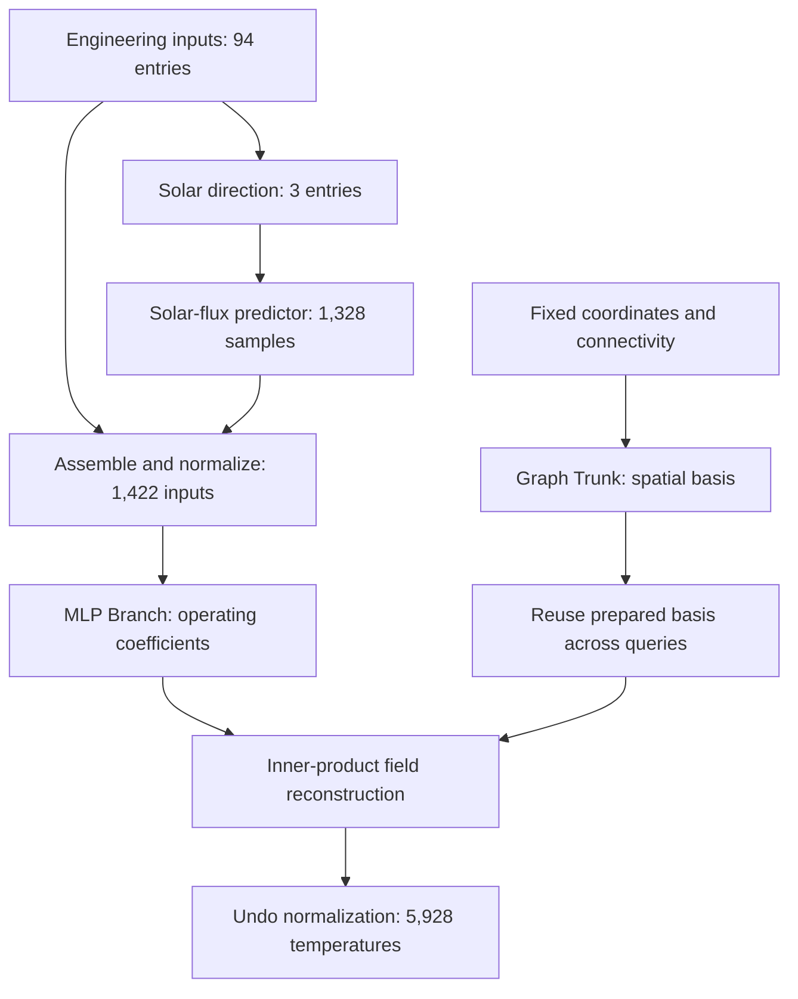

# SSTONet

**Topology-aware operator learning for satellite steady-state temperature fields.**

SSTONet learns to reconstruct the full temperature field of a satellite as its operating conditions, optical properties, and thermal contacts change. The project combines a graph-based spatial representation with operator learning to support repeated thermal-design assessments, including temperature errors at individual components and their interfaces.

> **Release status:** This repository currently contains the project overview only. The source code, trained model weights, and access to the associated dataset will be made publicly available here **after the manuscript is accepted for publication in Aerospace Science and Technology (AST)**. The research implementation and data are not yet released.

[Research overview](#research-overview) · [Architecture](#architecture) · [Project structure](#project-structure) · [Research workflow](#research-workflow) · [Results](#results) · [NXOpen companion](#nxopen-companion) · [Release plan](#release-plan)

## Research overview

Thermal design often requires evaluating many combinations of component power, surface properties, solar direction, and contact conditions for the same satellite assembly. High-fidelity simulation provides detailed temperature fields, but repeated solves are expensive. Full-field prediction helps engineers inspect local hot and cold regions, compare component responses, and identify temperature differences across connected parts.

SSTONet approximates the steady-state solutions produced by Siemens NX Space Systems Thermal (NX SST). Its spatial representation uses the assembly's connectivity, while its operating-condition encoder accounts for changing thermal inputs. The engineering goal is fast, locally informative assessment within the sampled operating domain of a fixed satellite model.

### Reference problem

| Item | Current study |
| --- | --- |
| Physical system | A fixed 1U CubeSat assembly |
| Reference solver | Siemens NX Space Systems Thermal |
| Components | 14 |
| Temperature outputs | 5,928 thermal nodes per case |
| Reference database | 5,000 simulation cases generated using Latin hypercube sampling |
| Data split | 4,000 training, 500 validation, and 500 held-out test cases |
| Engineering input vector | 94 entries describing solar direction, regional powers, optical properties, and contact/coupling values |
| Incident solar-flux field | 1,328 samples |
| Temperature-network input | 1,422 entries after combining engineering inputs and flux samples |

The 94 engineering entries comprise 3 solar-direction components, 20 regional powers, 28 emissivities, 28 absorptivities, and 15 contact/coupling parameters. These are the expanded model inputs; their count does not represent 94 independently sampled physical variables. The incident-flux samples describe a derived field.

### What the project investigates

- **Temperature-field reconstruction:** learn all nodal temperatures from the operating conditions of the fixed assembly.
- **Topology-aware spatial encoding:** compare finite-element connectivity with neighborhoods built from coordinates and component labels.
- **Component and interface accuracy:** examine where errors occur, including predefined thermal-coupling regions.
- **Repeated online prediction:** estimate incident solar flux and reuse the trained spatial basis across operating cases.
- **Controlled evaluation:** compare model families, graph choices, edge weighting, training-data size, spatial supervision, and independent training runs.

## Architecture

SSTONet follows the Branch and Trunk factorization used in DeepONet. A multilayer perceptron (MLP) Branch converts each operating input into a vector of coefficients. A graph neural network (GNN) Trunk converts fixed node coordinates and connectivity into a spatial basis. Combining the coefficients with that basis reconstructs the nodal temperature field.



The diagram shows online prediction after training. During offline data generation, NX supplies the incident-flux samples and reference temperature fields. The online solar-flux predictor supplies the corresponding flux inputs for a new operating case.

For a normalized input vector $u$, the temperature network evaluates

$$
\widehat{T}_i = \sum_{k=1}^{r} b_k(u) \cdot t_k(\mathbf{x}_i,\mathcal{G}) + b_0.
$$

where $b_k$ are the Branch coefficients, $t_k$ are the graph-based spatial features, and $\mathcal{G}$ is the fixed node graph. The output is then converted back to physical temperature units.

### Two spatial graph variants

| Variant | Graph construction | Role |
| --- | --- | --- |
| **SSTONet-FEM** | Adjacency extracted from the finite-element mesh | Uses available mesh connectivity to construct the spatial basis |
| **SSTONet-KNN** | K-nearest neighbors within each component, with radius-based links between components | Provides a coordinate-and-component alternative when mesh connectivity is unavailable |

The implemented graph layers use geometric edge information to guide spatial encoding. The graph captures local connectivity; it is not the complete NX conductance or radiation-exchange matrix. Changing contact/coupling values enter through the Branch input while the spatial graph remains fixed.

### Reusing the spatial basis

Once a model is trained, its Trunk output can be computed once for the fixed graph. Subsequent operating cases evaluate the Branch and reconstruct the field from the stored basis. This avoids repeating graph propagation in the temperature network.

The prepared basis belongs to a specific model checkpoint, geometry, graph, edge weights, device, and numerical precision. A change to these inputs requires rebuilding it. The engineering inputs and predicted solar-flux field can vary between queries.

## Project structure

**The tree below describes the existing research codebase. These directories are not yet present in this public repository.** It provides an implementation map for readers; the public release will contain a curated version of the research software and supporting materials.

```text
SSTONet/
├── sstonet/                         # Importable Python package
│   ├── data/
│   │   └── loader.py                # NX exports, input assembly, field loading
│   ├── models/
│   │   ├── deeponet.py              # DeepONet, MIONet, graph Trunks, full-field GNN
│   │   ├── graph_utils.py           # Component-aware neighborhood construction
│   │   ├── dual_graph.py            # Branch-GNN and Dual-Graph comparisons
│   │   ├── recent_baselines.py      # Geometry, attention, and Fourier adaptations
│   │   ├── mlp.py                   # Direct temperature-field regression
│   │   └── pod_mlp.py               # POD analysis and reduced-order regression
│   ├── training/                   # Model-specific training and evaluation
│   ├── inference/
│   │   └── trunk_cache.py           # Prepared Trunk basis and validity checks
│   ├── benchmarking/               # Online input adapters, timing, run checks
│   ├── utils/
│   │   └── metrics.py              # Full-field error metrics
│   ├── config.py                   # Configuration loading
│   └── callbacks.py                # Training callbacks
├── configs/                        # YAML model and experiment settings
├── scripts/
│   ├── train.py                    # Shared training entry point
│   ├── extract_mesh_from_inpf.py   # Mesh extraction and graph preparation
│   ├── analyze_component_metrics.py
│   ├── analyze_thermal_coupling.py
│   ├── plot_temperature_field.py
│   ├── train_resolution_generalization.py
│   ├── train_resolution_generalization_gnn.py
│   ├── ast_revision/               # Repeated-run, statistics, flux, cache studies
│   └── cja_revision/               # Earlier experiment and analysis utilities
├── data/
│   ├── graph/                      # Coordinates, adjacency, component mappings
│   └── stl_files/                  # Geometry assets used for visualization
├── results/                        # Experiment outputs and selected evidence
├── tests/                          # Model, trainer, cache, and benchmark checks
├── validation/                     # Auxiliary 14-node thermal-network study
├── docs/                           # Method notes and manuscript working assets
├── paper/                          # Earlier manuscript and typesetting assets
├── pyproject.toml                  # Package metadata and dependency groups
└── README.md
```

The runtime package, experiment configurations, and executable scripts have separate roles. `sstonet/` contains reusable implementations, `configs/` defines experiments, and `scripts/` connects the implementations to data and output locations. `results/` stores run outputs and selected evidence. Full simulation exports and large checkpoints are managed separately from the small source and configuration files.

### Model names in the implementation

| Research model | Training identifier | Configuration |
| --- | --- | --- |
| SSTONet-FEM | `gnn_deeponet` | `configs/gnn_deeponet.yaml` |
| SSTONet-KNN | `component_gnn_deeponet` | `configs/component_gnn_deeponet.yaml` |
| Full-field GNN | `pure_gnn` | `configs/pure_gnn.yaml` |
| Branch-GNN comparison | `branch_gnn_deeponet` | `configs/branch_gnn_deeponet.yaml` |
| Dual-Graph comparison | `dual_graph_fem` | `configs/dual_graph_fem.yaml` |

The codebase also includes MLP, POD-MLP, DeepONet, POD-DeepONet, MIONet, and task-specific adaptations of geometry-aware, attention-based, and Fourier operator models. POD denotes proper orthogonal decomposition, which represents a temperature field using a compact set of spatial modes.

## Research workflow

### 1. Generate reference simulations

Define the satellite model and parameter ranges in NX SST. Use the [NXOpen companion](#nxopen-companion) to sample operating conditions, update model parameters, run thermal solves, and export temperatures and radiation-related results.

### 2. Prepare inputs, outputs, and graphs

Organize parameter logs and field exports into consistent component and node orders. Assemble the engineering and incident-flux inputs, prepare the FEM or component-aware graph, and apply the recorded train/validation/test split. Preserve the coordinate mappings, input order, normalization information, and units needed to interpret predictions.

### 3. Train and evaluate the temperature models

Use the shared training entry point with a model-specific YAML configuration. The training workflow records configuration snapshots, data-split information, checkpoints, learning histories, and evaluation metrics.

The current command structure is shown below as a **preview for the future release**. Running these commands requires the research source, prepared data, and graph files, which are not available from this public repository yet.

```bash
# SSTONet with FEM adjacency
python scripts/train.py --model gnn_deeponet --config configs/gnn_deeponet.yaml

# SSTONet with component-aware neighborhoods
python scripts/train.py --model component_gnn_deeponet --config configs/component_gnn_deeponet.yaml
```

The software uses Python and PyTorch, with NumPy, pandas, SciPy, scikit-learn, and YAML-based configuration. The release will provide environment instructions and configurable data paths. NX automation runs in the Windows NX / Simcenter 3D environment; surrogate training and prediction use a separate Python environment.

### 4. Prepare online prediction

Train the auxiliary solar-flux predictor, load the temperature checkpoint and its preprocessing information, and prepare the fixed graph. For repeated queries, precompute the Trunk basis. Each new query then assembles the predicted flux and engineering inputs, reconstructs the temperature field, and returns temperatures in physical units.

### 5. Inspect accuracy and computational cost

Evaluate full-field metrics together with component and interface errors. The supporting studies examine graph construction, edge weighting, spatial supervision, training-set size, independent training runs, and paired statistical comparisons. Online measurements distinguish temperature-network evaluation from the complete query, including flux prediction and data movement.

The `validation/` study uses a simplified 14-node lumped thermal network as an auxiliary component-level trend check. Full-field surrogate accuracy is evaluated against the 5,928-node NX reference solutions.

## Results

The following values summarize the current manuscript and its recorded experiments. They describe the fixed 1U CubeSat benchmark within its sampled parameter domain.

### Temperature-field accuracy

| Main benchmark model | Mean relative L2 error | RMSE |
| --- | ---: | ---: |
| SSTONet-FEM | 0.6224% | 2.2293 K |
| SSTONet-KNN | 0.6675% | 2.3467 K |

These are the selected seed-42 models evaluated on 500 held-out cases with the benchmark flux inputs. Across three independent training runs on the same split, SSTONet-FEM achieves a relative L2 error of **0.6167 ± 0.0058%**, reported as mean ± sample standard deviation. The experiments also report component errors, interface errors, maximum nodal error, and paired confidence intervals.

### Complete online query

| SSTONet-FEM inference mode | Time per case, mean ± sample standard deviation |
| --- | ---: |
| Recompute the Trunk for each query | 27.59 ± 1.36 ms |
| Reuse the prepared Trunk basis | 3.86 ± 1.15 ms |

These measurements use an Apple M3 Max, PyTorch MPS, FP32, batch size 1, and 50 measurements per mode. Timing starts with the expanded 94-entry engineering vector on the CPU and ends with the temperature field returned to the CPU. It includes solar-flux prediction, input assembly, normalization, temperature reconstruction, and the required device transfers. Model and graph loading, parameter expansion, regional power allocation, and cache construction occur before timing.

The reference database has an estimated cost of about **750 serial-equivalent hours**, based on 5,000 NX cases at approximately 9 minutes per solve. This is an offline computation estimate. The value of the surrogate depends on repeated use of the prepared database and trained models.

### Scope of the evidence

The reported results concern steady-state prediction for the same satellite geometry, component partition, and thermal topology used to build the database. Spatial-supervision studies assess reconstruction within that reference geometry. Applying the workflow to a new assembly, a different physical regime, or parameters outside the sampled domain requires additional data and validation.

## NXOpen companion

[**NXOpen_satellite**](https://github.com/Ne1ther/NXOpen_satellite) is the companion automation project for Siemens NX / Simcenter 3D. It supports the simulation and data-generation stage of this research and is maintained as a separate repository.

| Repository | Responsibility |
| --- | --- |
| **SSTONet** | Data preparation for learning, neural surrogate models, training, temperature-field prediction, and accuracy/cost evaluation |
| **NXOpen_satellite** | Thermal-parameter editing, design-of-experiments batch runs, solver orchestration, and simulation-result export |

The companion toolkit provides workflows for optical properties, heat loads, thermal couplings, solar vectors, restartable batch solves, nodal-temperature export, radiation-result export, and offline processing of existing `.bun` result files. Its execution requires a suitable NX / Simcenter 3D installation and the corresponding simulation project.

**NXOpen_satellite does not contain the SSTONet models, trained weights, or research dataset.** It provides the automation used around the reference solver. See its [English documentation](https://github.com/Ne1ther/NXOpen_satellite#english-readme) for setup and supported workflows.

## Release plan

| Material | Availability |
| --- | --- |
| English project overview and implementation map | Available in this README |
| SSTONet source code and experiment configurations | Planned for public release after AST acceptance |
| Trained model weights | Planned for public release after AST acceptance |
| Associated dataset access | To be provided through this repository after AST acceptance |
| Reproduction instructions, environment details, and usage terms | To accompany the research release |
| NX / Simcenter 3D automation toolkit | Available separately in [NXOpen_satellite](https://github.com/Ne1ther/NXOpen_satellite) |

The release will organize the software, weights, data-access instructions, and English documentation into a reproducible research package. Proprietary Siemens software and project-specific NX simulation files are outside the promised release materials.

### Associated manuscript

**Satellite Temperature Field Prediction under Varying Thermal Contact Conditions Using Topology-Aware Operator Learning**

The public research release is tied to acceptance in *Aerospace Science and Technology*. Publication details, a DOI, and a citation entry will be added when available.
